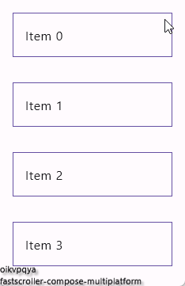

## FastScroller for Compose Multiplatform

Implementing scroll bars in Compose Multiplatform

The scroll bar implementations available in `androidx.compose.foundation:foundation` library, but it is [currently available for Compose Multiplatform without Android](https://github.com/JetBrains/compose-multiplatform/tree/master/tutorials/Desktop_Components#scrollbars). (To be precise, it is available on all platforms except Android, but the implementation is not optimized for mobile.)

This library changes that, by providing the scroll bar implementations for many of the platforms supported by Compose Multiplatform.
And more changes inspired by [Google's Launcher3 FastScroller](https://android.googlesource.com/platform/packages/apps/Launcher3/).



## Usage

Usage is very simple:

```kotlin
import io.github.oikvpqya.compose.fastscroller.VerticalScrollbar
import io.github.oikvpqya.compose.fastscroller.material.defaultMaterialScrollbarStyle
import io.github.oikvpqya.compose.fastscroller.rememberScrollbarAdapter

@Composable
fun Screen() {
    val state = rememberLazyListState()

    LazyColumn(
        modifier = Modifier.fillMaxSize(),
        state = state,
    ) {  
        Box (/* ... */){
            Image (/* ... */)
            Text (fontSize = fontSize)
        }
    }

    VerticalScrollbar(
        modifier = Modifier.align(Alignment.TopEnd).fillMaxHeight(),
        adapter = rememberScrollbarAdapter(scrollState = state),
        style = defaultMaterialScrollbarStyle(),
        enablePressToScroll = false,
    )
}
```

See [samples](https://github.com/oikvpqya/fastscroller-compose-multiplatform/tree/main/sample) or [github page](https://oikvpqya.github.io/fastscroller-compose-multiplatform/).

In [kmp sample app](https://github.com/oikvpqya/fastscroller-compose-multiplatform/blob/main/sample/kmp/src/commonMain/kotlin/Screen.kt), you can see an example of a scrollbar indicator.

## Installation

```gradle
repositories {
    mavenCentral()
}

dependencies {
    implementation "io.github.oikvpqya.compose.fastscroller:fastscroller-core:0.2.0"

    // Optional: Provides scroll bar Material Design 2 theme by defaultMaterialScrollbarStyle
    implementation "io.github.oikvpqya.compose.fastscroller:fastscroller-material:0.2.0"

    // Optional: Provides scroll bar Material Design 3 theme by defaultMaterialScrollbarStyle
    implementation "io.github.oikvpqya.compose.fastscroller:fastscroller-material3:0.2.0"

    // Optional: Provides scroll bar indicator shape
    implementation "io.github.oikvpqya.compose.fastscroller:fastscroller-indicator:0.2.0"
}
```

## Credits

FastScroller for Compose Multiplatform is inspired by the following libraries:

[JetBrains's Compose Multiplatform Scrollbar](https://github.com/JetBrains/compose-multiplatform-core/blob/jb-main/compose/foundation/foundation/src/skikoMain/kotlin/androidx/compose/foundation/Scrollbar.skiko.kt)

[Google's Launcher3 FastScroller](https://android.googlesource.com/platform/packages/apps/Launcher3/)


## License

```
Copyright 2024 The Android Open Source Project
Portions 2024 oikvpqya Yuya
 
Licensed under the Apache License, Version 2.0 (the "License");
you may not use this file except in compliance with the License.
You may obtain a copy of the License at

    https://www.apache.org/licenses/LICENSE-2.0

Unless required by applicable law or agreed to in writing, software
distributed under the License is distributed on an "AS IS" BASIS,
WITHOUT WARRANTIES OR CONDITIONS OF ANY KIND, either express or implied.
See the License for the specific language governing permissions and
limitations under the License.
```
